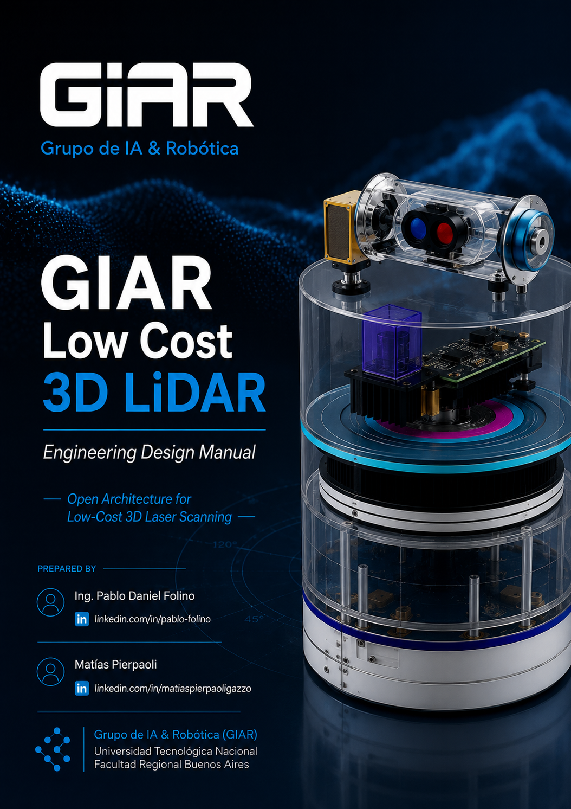

\ newpage
\---

title: GIAR Low Cost 3D LiDAR

subtitle: Engineering Manual

author:

&#x20; - Pablo Daniel Folino

&#x20; - Matías Pierpaoli

organization: Grupo de Inteligencia Artificial y Robótica (GIAR)

version: 0.1

document: GIAR-DOC-001

date: Julio 2026

\---

\# GIAR Low Cost 3D LiDAR

> \*\*Engineering Manual\*\*

!\[Portada](Figures/Cover.png)

\---

\# Historial de Revisiones

| Versión | Fecha | Autor | Descripción |

|---------:|:------|:------|:------------|

| 0.1 | Julio 2026 | Pablo D. Folino | Creación del documento |

\---

\# Índice

> \*El índice será generado automáticamente al convertir el documento.\*

\---

\# Lista de Figuras

> \*Generada automáticamente.\*

\---

\# Lista de Tablas

> \*Generada automáticamente.\*

\---

\# Lista de Abreviaturas

| Sigla | Descripción |

|--------|-------------|

| ESP32 | Espressif ESP32-WROOM-32 |

| UART | Universal Asynchronous Receiver Transmitter |

| TTL | Transistor-Transistor Logic |

| LiDAR | Light Detection and Ranging |

| ToF | Time of Flight |

| TMC2208 | Driver Trinamic para motores paso a paso |

\---

\# 1. Introducción

\## 1.1 Motivación

El proyecto \*\*GIAR Low Cost 3D LiDAR\*\* tiene como objetivo desarrollar un sistema de adquisición tridimensional de bajo costo, abierto y reproducible, orientado a aplicaciones de investigación, docencia y robótica.

A diferencia de los sensores LiDAR comerciales de alto costo, este proyecto busca combinar componentes ampliamente disponibles para construir una plataforma flexible y extensible.

El sistema está basado en un microcontrolador \*\*ESP32-WROOM-32\*\*, un sensor \*\*TFMini-S\*\*, dos controladores \*\*TMC2208\*\*, un motor \*\*NEMA17\*\* y un micromotor reductor \*\*118:1\*\*, permitiendo el escaneo tridimensional mediante el movimiento coordinado de ambos ejes.

\---

\## 1.2 Objetivo del documento

Este manual constituye la documentación técnica oficial del proyecto.

Describe:

\- Arquitectura del sistema.

\- Diseño mecánico.

\- Diseño electrónico.

\- Firmware.

\- Protocolo de comunicación.

\- Simulación.

\- Ensayos.

\- Resultados.

\---

\# 2. Objetivos

\## 2.1 Objetivo General

Desarrollar un sistema LiDAR 3D de bajo costo, abierto y reproducible para aplicaciones de robótica e investigación.

\## 2.2 Objetivos Específicos

\- Diseñar una arquitectura modular.

\- Desarrollar un firmware reutilizable.

\- Diseñar la electrónica utilizando KiCad.

\- Implementar un protocolo robusto de comunicación.

\- Integrar el sistema con CoppeliaSim.

\- Documentar completamente el desarrollo.

\---

\# 3. Arquitectura

\## 3.1 Arquitectura General

!\[Arquitectura General](Figures/SystemArchitecture.svg)

El sistema se organiza alrededor de un ESP32-WROOM-32 que actúa como controlador principal.

La comunicación con la PC se realiza mediante una interfaz UART TTL de 3,3 V.

El ESP32 controla:

\- Sensor LiDAR TFMini-S.

\- Driver TMC2208 del motor NEMA17.

\- Driver TMC2208 del micromotor reductor.

\---

\## 3.2 Arquitectura Hardware

!\[Hardware](Figures/HardwareArchitecture.svg)

\### Componentes

\- ESP32-WROOM-32

\- TFMini-S

\- TMC2208 ×2

\- NEMA17

\- Micromotor 118:1

\---

\## 3.3 Arquitectura Firmware

!\[Firmware](Figures/FirmwareArchitecture.svg)

El firmware se divide en los siguientes módulos:

\- Inicialización.

\- Comunicaciones.

\- Parser de comandos.

\- Control del LiDAR.

\- Control de motores.

\- Protocolo.

\- Gestión de errores.

\---

\## 3.4 Arquitectura de Comunicaciones

La comunicación entre la PC y el ESP32 utiliza un protocolo binario propio.

| Campo | Descripción |

|--------|-------------|

| 0x59 | Flag de inicio |

| 0x59 | Flag de inicio |

| Longitud | Longitud total |

| Dispositivo | Identificador |

| Comando | Acción solicitada |

| Datos | Parámetros |

| Checksum | Verificación |

\---

\## 3.5 Arquitectura de Simulación

!\[Simulation](Figures/SimulationArchitecture.svg)

La simulación se realizará en \*\*CoppeliaSim\*\*, utilizando el mismo protocolo implementado en el hardware real.

\---

\# Próximos capítulos

4\. Diseño Mecánico

5\. Diseño Electrónico

6\. Firmware

7\. Protocolo de Comunicación

8\. Simulación

9\. Integración

10\. Ensayos

11\. Resultados

12\. Trabajos Futuros

\---

\# Bibliografía

\*(En construcción)\*

